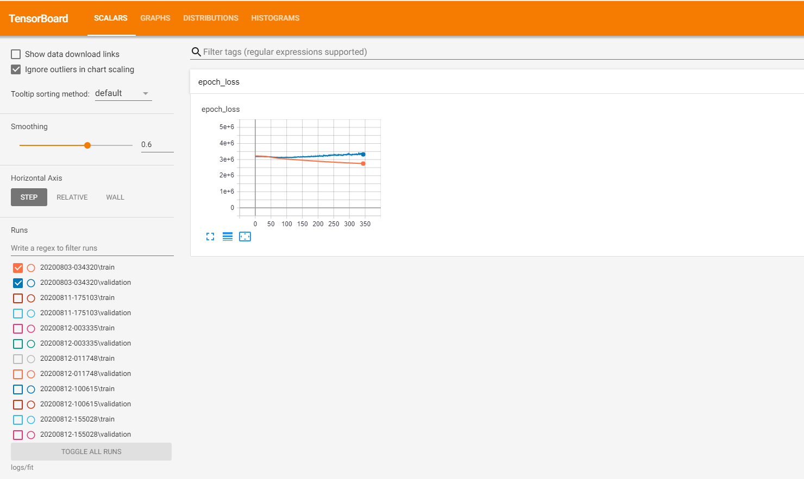
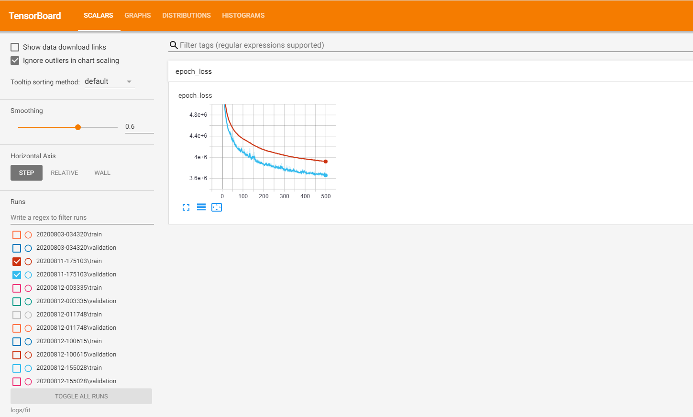
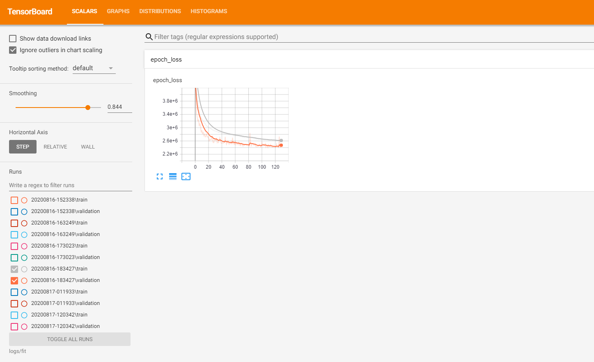
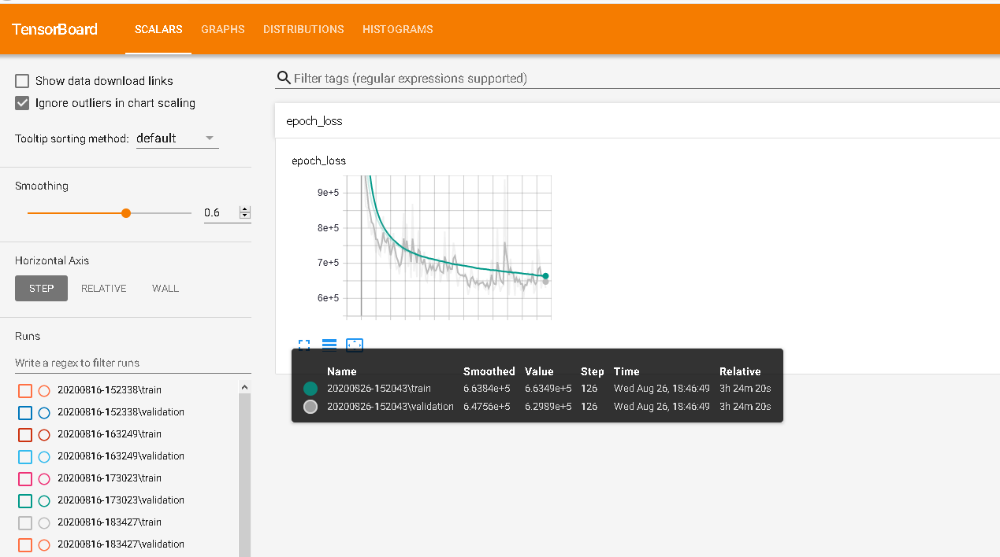

BagelChess
==========

BagelChess is a deep learning chess engine. I was inspired by the resurgence of chess this summer in the streaming and online community and my own games with my friends to pursue something at the intersection of my interests--coding and chess. The current iteration utilizes a deep learning convolutional neural network with five convolutional layers of rectified linear activation functions bolstered with L2 regularization and batch normalization followed by 2 layers of dense rectified linear activation functions and L2 regularization. This neural network is used for board evaluation, while at the moment the MTD(f) algorithm is used to traverse the move selection tree with zero window alpha beta minimax calls bolstered with iterative deepening and a transposition table.

Demo
-------------------
The project is currently hosted in a limited fashion at <a href="http://bagelchess.com">bagelchess.com</a>. However, this demo is limited in search depth by the cost of cloud computing--the cluster used doesn't have a GPU because it would be prohibitively expensive to run for a significant period of time, and thus has a lower search depth and slower move time than if run on a local system with decent specifications.

Planned Development
-------------------

Short Term : 
- Improve model structure and hyperparameters 
- Optimize current move selection strategy

Long Term : 
- Train a larger dataset - Improve move selection with optimization of the move tree, or with Monte Carlo Tree Search 
- Build my own bitboard game representation and move generator 
- Convert to self play rather than existing data

Construction
------------

As my first foray into chess programming and an early foray into machine
learning, I sought to pick a structure that would be challenging to implement
and require research but not be unnattainable. As such, I decided to work with
minimax instead of a Monte Carlo Tree search, and a simpler goal for my neural
network-- evaluating positions from a board representation without worrying
about move probabilities, focused instead on pure centipawn rating.

I obtained my data from the fics database, starting with a smaller sample of
5000 games, expanded to all positions that were present during the game to
create an 800,000 sample dataframe. I then used stockfish to produce evaluations
for every position, creating the validation data for supervised learning.

After a lot of tweaking to avoid a severe overfitting problem, my best neural
network model involved two 36 node convolutional layers with a L2
regularization, a max pooling layer, and batch normalization, followed by a
fully connected relu layer with 50% dropout. The loss graph for the model looked
like this:

Even at its best, the old data produced moves barely better than random, with
very little connection to realistic chess play other than simple material
evaluation. Overfitting was extremely severe.

I decided that after tweaking the model structure and hyperparameters for weeks,
the best option was to train a new, larger dataset. I extracted ten times the
games, 50,000, from the fics database, all standard play at all levels in June
2020. I processed it (which took around a week and a half with my computer,
considering the size of the final database) and produced a 3.7 million sample
csv with stockfish labels.

After trying my previous optimal model on the new data, the difference was
stark-- rather than marginal declines over large numbers of epochs, the model
immediately began substantively improving, producing a promising graph that was
underfitting rather than overfitting.

With much more room to experiment (although much longer training times) I begin
again the process of tweaking the model. I experimented with different numbers
of both densely connected and convolutional layers, different dropout areas,
learning rates, nodes per layer, regularization parameters, and eventually,
weight decay with the tensorflow addons.

My second-to-last model was far, far better than my original, producing the following loss graph:

I concluded that the best way to move forward, considering I was once again facing overfitting, was to collect and even larger dataset. I pulled 621,000 games from the FICS game database and split it into 12 pieces, and processed 1.5 of them (prevented from processing more by time and moving). Each portion was ~3.4 million positions, making my final data set 9.4 million samples. With this, and a further tweaked and updated model, I achieved the following loss graph:

This model achieves an 80.3% explained variance score, a huge stride from earlier sub-50% scores.

Although move selection was slow, making games slow, I played several games against the engine. Although I'm not great at chess, I would estimate myself to be 1200-1500 ELO when given sufficient depth (>3). It clearly improves with greater depth (at the cost of move time). Its greatest vulnerabilities are its inability to see particularly far in the future (complex trades, multi-step checkmates against it) and the margin for error allowing unecessary hanging pawns. However, it is particularly good at targeting high value pieces like rooks and queens, and especially good at endgame checks and checkmates (although not pawn endgames).

In order to improve move selection, I optimized the implicit move generation to only use a single board, and added a transposition table in addition to iterative deepening and move ordering via lazy evaluation with piece-square tables to roughly sort the next moves to evaluate from a position and improve alpha beta pruning.

I also constructed a website for the engine where it can be played against
utilizing flask and two chess libraries--one for the board, one for the
game--utilizing libraries because I had limited time and my focus was on the
engine side.

Dependencies
------------

-   Python-Chess

-   Chess.js

-   Chessboard.js

-   Tensorflow

-   Keras

-   Numpy

-   Pandas

Get Started
===========

Download the package and unzip it. A working model is included as well as all
the data preprocessing and utility classes for minimax and the model. By running
application.py, you can work with a fully functioning hosted chess game against my
engine, or you can process a new model using my data preprocessing and training
functions by finding any pgn and converting it to a csv. There are several duplicate
files, but the important ones are CNN.py, app.py, and dataPreprocessing.py.
